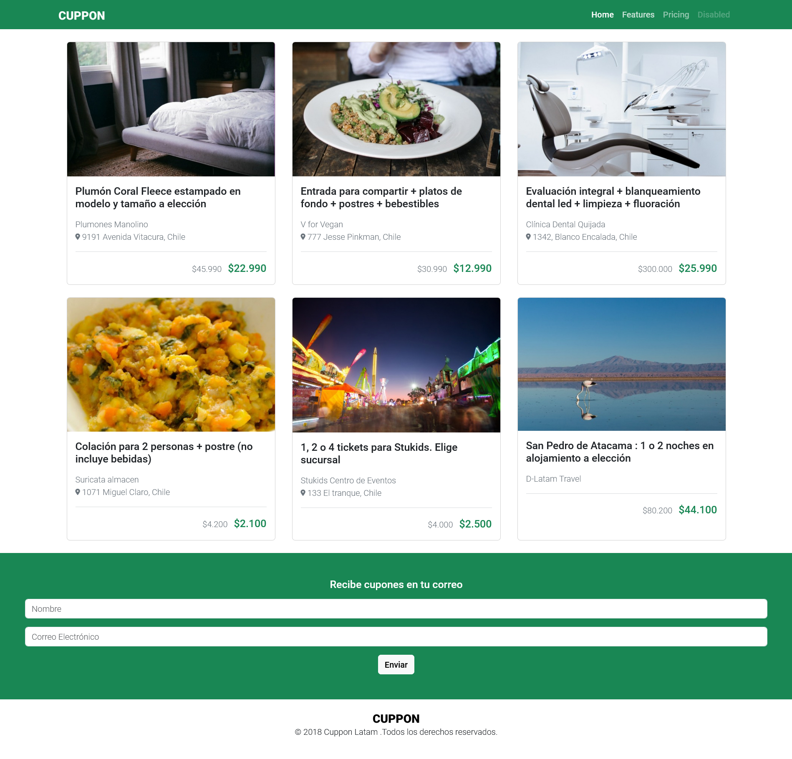
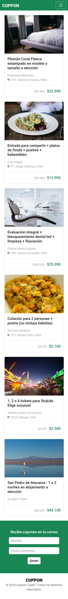

# Desafío 4 - Cuppon 🛍️

Este proyecto es parte del Desafío 4 del Bootcamp Desarrollo Full Stack JavaScript, donde se aplicaron conocimientos sobre Bootstrap para crear una página web adaptable a distintos dispositivos.

## Descripción 🚀

El objetivo de este desafío era construir una página web de venta de productos con una versión para escritorio, tablet y teléfonos móviles. Se utilizaron las siguientes tecnologías y herramientas:

- **HTML5**: Para la estructura del sitio.
- **CSS3**: Se emplearon estilos personalizados y clases de Bootstrap.
- **Bootstrap 5**: Se utilizó para la grilla responsiva, componentes de tarjetas y formularios.
- **Font Awesome**: Para íconos.
- **Google Fonts**: Para la tipografía.

## Vista previa 🖼️

A continuación se presenta una vista previa de la página:

### Escritorio

### Móvil

## Estructura de carpetas 📂

- `/assets/img`: Contiene las imágenes utilizadas en el proyecto.
- `/assets/css/style.css`: Archivo CSS personalizado.
- `/index.html`: Archivo HTML principal.

## Requerimientos del Desafío ✔️

1. **Grilla responsiva:** Se utilizó la grilla de Bootstrap para distribuir los cupones en 1 columna para Mobile y 3 para Desktop.
2. **Clases de colores:** Se emplearon las clases de colores de Bootstrap según la maqueta.
3. **Clases para margin y padding:** Se utilizaron las clases de Bootstrap para asignar margen y relleno.
4. **Componente Card:** Se diseñaron las tarjetas de los cupones utilizando el componente Card de Bootstrap.
5. **Estructura e indentación:** El código del proyecto está debidamente indentado y se siguió la estructura de carpetas especificada.

## Consideraciones y recomendaciones 📝

- Se siguió el principio de diseño "mobile first".
- Se cuidó el orden de carga de los archivos CSS, tipografía y otros necesarios.
- Se personalizó la paleta de colores para darle una identidad propia al proyecto.

## Autor 👨‍💻

Este proyecto fue desarrollado por [Tu Nombre].

© 2023 Cuppon Latam. Todos los derechos reservados.
